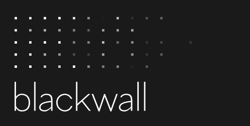

An application layer firewall module for NodeJS
-----------------
**blackwall** is an **incoming*** application-layer firewall module designed for NodeJS. You can integrate it into your TCP connections or as an ExpressJS middleware, define a few rules and enforce a good deal of security for your server application.

\* *blackwall* currently only supports incoming connections. Outgoing support is planned for the first release.

# Features
Currently included in the *Alpha* version:
1. ipv4 & ipv6 support
- List specific policies
- Events
- Frameworks
- Rate limiting
- Blacklisting
- *Upcoming: Whitelisting*
- *Upcoming: Conditional policy change*
- *Upcoming: Mass member add*
- *Upcoming: Dump and restore for policies*

# Usage
```
npm install blackwall
```

Enabling **blackwall** on an Express server with defined rules:
```javascript
var express = require("express");
var blackwall = require("blackwall");

// Create a new instance of blackwall
var firewall = new blackwall();
// Modify Global list rules to 60 connections per minute
firewall.modifyRule("global", { rate: { m:60 } }, true);

app.use(firewall.enforce("express"));

app.get('/', function (req, res) { res.send('Hello World!') })
app.listen(3000);
```

Enabling a custom instance of **blackwall** on a TCP server with defined rules:
```javascript
var net = require("net");
var blackwall = require("blackwall");

// Create a new instance of blackwall
var firewall = new blackwall();
// Modify Global list rules to 60 connections per minute
firewall.modifyRule("global", { rate: { m:60 } }, true);

var server = net.createServer(function(socket) {
    // Defined custom rule
    firewall.enforce()(
        socket.remoteAddress,
        function() { socket.end("FIREWALL"); },
        function() { socket.write('connected'); }
    )
});
server.listen(3100);
```

# Methods

**addList:** (name:String, rules:Object, priority:Float, global:Bool, force:Bool) - *Creates a new list with the given rules and priority. Set force to true to modify if list exists.*

**modifyRule:** (listName:String, rule:Object, merge:Bool) - *Modifies rules for a given list. Set merge to true to merge existing and new rules.*

**addMember:** (list:String, ip:String) -
*Adds a member (ipv4 or ipv6 address) to a list.*

**addFramework:** (name:String, framework:Object) - *Adds a given framework to frameworks list. This can be later called through .enforce(framework-name)*

**enforce:** (framework:String, options:Object) - *returns a function to be applied when a new connection is made.*

**session:** (ip:String, callback:Function) - *Creates a session and returns two arguments (error, hasAccess) to the callback. (This is automatically done by the enforce function)*

# Lists
Lists are useful for assigning certain ips to specific rules. For example a list named *blacklist* can block all the members added to the list. Although *blacklist* is integrated by default you can create a new list named *blacklist* using the following code:


```javascript
var blackwall = require("blackwall");
var firewall = new blackwall();

// We'll use the force argument to replace the default blacklist
// Arguments: name, rule, priority, global, force
firewall.addList("blacklist", { block: true }, 1, false, true);

// You can then add members using:
firewall.addMember("blacklist", "127.0.0.2");

// Any connection from the given ip will now be blocked
```

#### Priority
Lists contain a priority value between 0 (last) and 1 (first). This value determines which rules will be assigned to a member. For example a priority of 1 should be used for whitelists/backlist a custom list with a value of 0.1xx to 0.9xx and 0 for the global list. This assures the following order:
1. Whitelist/Blacklist
2. Custom list
3. Global

#### Global lists
A list with global property will match all addresses. This should be generally used with a global set of rules that have a 0 priority value otherwise rules with lower priority will not be evaluated.

# Rules
Rules are objects defined in policies and assigned to lists. There is a rule-set for every list. For now rules accept the following parameters:

**rate:** { d:Number, h:Number, m:Number, s:Number } - *rate can be used for rate-limiting. You can set a maximum of x Number of times per **d**ay **h**our **m**inute or **s**econd that a single address can gain access.*

**block:** Bool - *Block can directly block access of addresses that fall under the list regardless of any other limits if set to **true**.*


# Frameworks
Frameworks are modules that return a function that enables **blackwall** integration to 3rd-party systems. Currently **blackwall** is packaged with:
- *Express* framework
- Custom framework

You can enforce **blackwall** using a custom code:
```javascript
var firewall = new blackwall();
var onAccess = firewall.enforce();

// Call onAccess to run firewall
/*  onAccess(
        <ip-address>,
        <function-to-terminate-access>,
        <function-to-call-when-access-granted>
    )
*/

```

# What's next?

Features planned for *Beta* version:
1. Session based policies
- Ip range support for ipv6 and ipv4
- Custom denial of service response
- Proxy support
- Bandwidth limiting
- Concurrent connection limiting

Features planned for *Stable Release* version:
1. Geo-location based policies
- Deep packet inspection
- Analytics
- Outgoing support

# Test Suite
You can test **blackwall** using the Mocha module. This includes express and TCP tests.
```javascript
npm test
```

# License
Who doesn't love [MIT license](https://raw.githubusercontent.com/schahriar/blackwall/master/LICENSE)?
